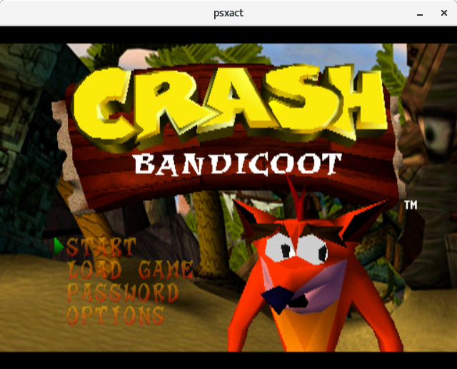

[](https://travis-ci.org/psxact/psxact)
[](https://ci.appveyor.com/project/adam-becker/psxact)


This project aims to emulate the PlayStation&trade; 1 console in an accurate
fashion. No hacks or shortcuts will be used to accomplish this goal. Everything
needed will be provided by default, this means there aren't any plug-ins to
locate, maintain, or configure.

## Current Status

Currently, the emulator is capable of booting a small amount of commercial
games with compatibility constantly evolving.



## Usage

The emulator requires a BIOS file, which can be dumped from a physical console.

Once you have a BIOS file, PSXACT can be invoked via command line, using the
following simple interface:

```
$ psxact <bios file here> <game file here>
```

## Building

This project uses CMake for builds, and requires SDL2.

## Contributing

If you'd like to contribute, please create a fork and issue pull requests!
Newcomers and experts alike are welcome to [contribute](.github/CONTRIBUTING.md).

## Communication

Join us on our `freenode` channel, `#psxact`!
